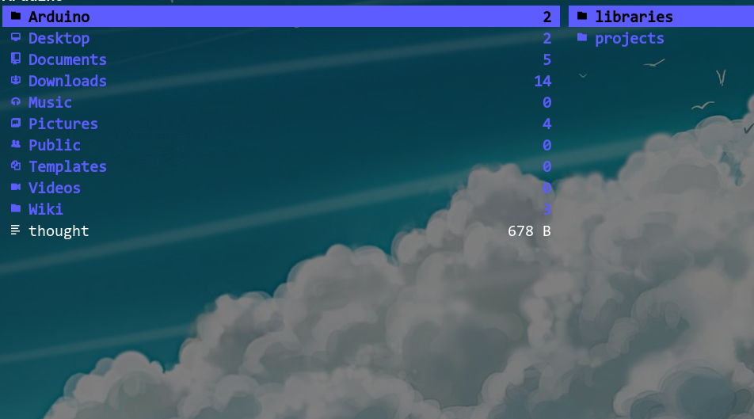
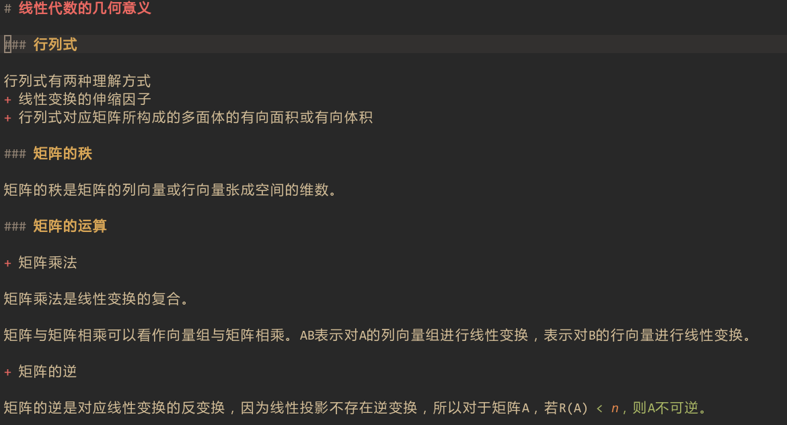
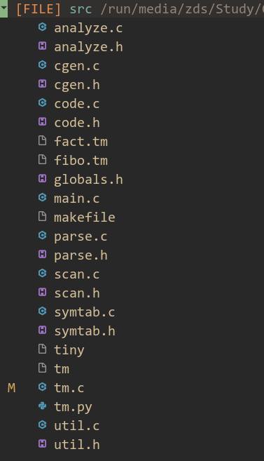

## 介绍

本仓库中的字体是[Consolas-with-Yahei](https://github.com/sharpglasses/Consolas-with-Yahei)经过[Nerd Font](https://github.com/ryanoasis/nerd-fonts) patch
过的字体，可以在终端中显示一些特殊字符。

本仓库中提供两款字体：
+ Consolas Nerd Font：特殊字符为双字符长度
+ Consolas Nerd Font Mono：特殊字符为单字符长度

## 截图

**注:** 截图中使用的是`Consolas Nerd Font Mono`字体 

+ 特殊字符在ranger中的显示

+ 中文字体在alacritty terminal下的显示效果

+ 文件图标的显示

